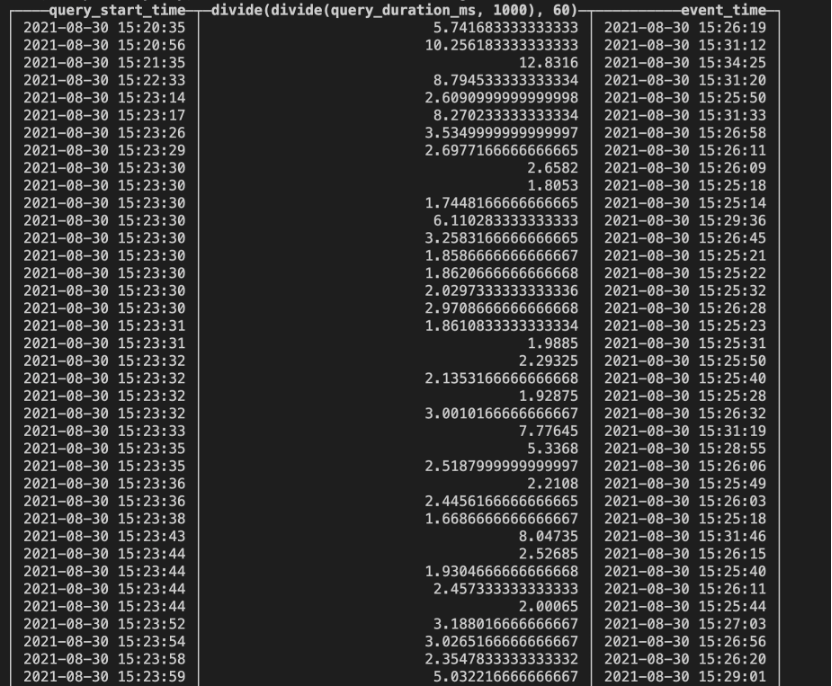

## 问题
今日线上的clickhouse集群突然出现查询失败的问题，查询日志发现是连接数打满了
```
2021.08.30 15:25:14.170792 [ 213608 ] {2610b4e7-d51a-43ad-856d-84bc0e502ccb} <Error> executeQuery: Code: 202, e.displayText() = DB::Exception: Received from 100.65.15.93:9000. DB::Exception: Too many simultaneous queries. Maximum: 100. Stack trace:  
```

## 定位
### 原因 
clickhouse在集群部署时可以修改配置最大并发查询参数, 当超过最大并发查询参数时就会直接提示异常，并且服务会挂掉[(参考: too many simulataneous)](https://stackoverflow.com/questions/43033077/too-many-simultaneous-queries-in-clickhouse)
```xml
<max_concurrent_queries>100</max_concurrent_queries>
```

### Why 限制高并发
因为clickhouse的查询会消耗大量CPU资源，当查询数过多时，CPU资源不够用就会导致查询速度变慢，查询排队挤压，内存溢出，服务器就会被打挂了

### How 高并发
由于高并发的限制，所以我们在应用场景中尽量避免出现高并发的查询场景。这个时候我们可以查询clickhouse system.query_log表，query_log表中包含了所有的查询相关的信息，例如：开始时间、处理持续时间、错误消息等。我们可以从这张表中查询出发生故障时间点的查询语句。
```sql
select query_start_time, query_duration_ms / 1000 / 60, event_time, query 
from system.query_log 
where query_start_time <= toDateTime('2021-08-30 15:25:15') and event_time >= toDateTime('2021-08-30 15:25:14') order by query_start_time;
```

查看返回结果可知在当前这一时刻出现了100条（时间误差只看到了99条，可以拉开时间线观察），因此可知确实是由于同一时刻查询并发数达到了clickhouse的限制，出现问题。

## 解决
通过对并发的sql进行分析，可以看到相同sql出现的次数比较高，并且查询的时间很长，出现了慢查询

### 暴力解决
修改clickhouse的并发数限制
### 优化查询语句
1. 通过query_log数据表定位到查询时间长并且查询频次高的sql
2. 打开debug日志
3. 执行该sql，发现没有命中索引(key condition & minmax condition)，每一次都是查询全表
```sql
-- 打开debug日志
set send_logs_level='debug';
-- 执行sql, 未命中到索引
SELECT 
    partition_time AS ds, 
    type
FROM tab
WHERE (partition_time >= 20210823) AND (partition_time <= 20210829) AND (set IN (27)) AND (type IN (0)) AND (scene IN (1))
GROUP BY 
    partition_time, 
    type
-- Key condition: (column 6 in 1-element set), unknown, unknown, and, (column 0 in 1-element set), and, unknown, and, and, (column 6 in 1-element set), and
-- MinMax index condition: unknown, (column 0 in [20210823, +inf)), (column 0 in (-inf, 20210829]), and, unknown, and, unknown, and, and, unknown, and
```


### 知识点
+ 为什么clickhouse不支持高并发的场景

+ 怎么对当前场景做保护

+ clickhouse的查询过程是什么，怎么对查询数保护？
  1. client发送查询到clickhouse服务
  2. clickhouse根据负载均衡策略，选取一个请求节点
  3. 查询语句请求到clickhouse集群所有分片查询数据
  4. 将分片查询出来的数据合并返回给客户端